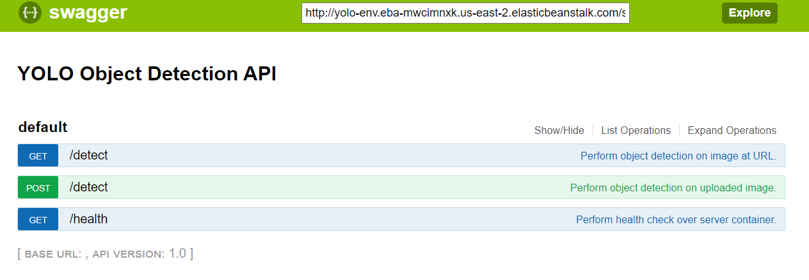

[](https://travis-ci.com/AQUINTERO446/yolo)
# YOLO Object Detection Service
Dockerized object detection service using YOLO based on AlexeyAB's darknet fork and exposed as a REST API using connexion.



### Quick start
You can build and run with:

`docker-compose up -d --build; docker-compose logs -f`

docker will expose the service over `localhost:80` and you can see a OpenAPI Specification at `localhost:80/ui`

### Env Vars
`$DOCKER_REPO` should be a valid docker image such as `aquintero446/yolo_service`

### Installation
Build the image
```bash
docker build -t $DOCKER_REPO:1.0-yolov3_coco \
	-f ./Dockerfile.dev \
	--build-arg weights_file="yolov3.weights" \
	--build-arg config_file="data/yolov3.cfg" \
	--build-arg meta_file="data/coco.data" \
       	. 
```
Follow vars will change the YOLO model:
* weights_file 
* config_file
* meta_file

### Dependencies
[Automatically installed when using the steps above.](./requirements.txt)

### Usage
Docker:
`docker run -dit --rm --name test_yolo -p 9999:8080 $DOCKER_REPO:1.0-yolov3_coco`

Docker compose:
`docker-compose up`

Send request:
```bash

curl -X POST -F 'image_file=@person.jpg' -F threshold=0.25 'http://localhost:9999/detect'
curl -X GET 'http://localhost:9999/detect?url=https%3A%2F%2Fgithub.com%2FAlexeyAB%2Fdarknet%2Fraw%2Fmaster%2Fdata%2Fperson.jpg'

```

### Travis
You must configure some env variables to work properly:
* **`DOCKER_ID`** docker user/id
* **`DOCKER_PASSWORD`** docker password
* **`DOCKER_REPO`** docker repo with docker user id userid/tpkutils-server
* **`AWS_ACCESS_KEY`** aws access key credential
* **`AWS_SECRET_KEY`** aws access secret credential
